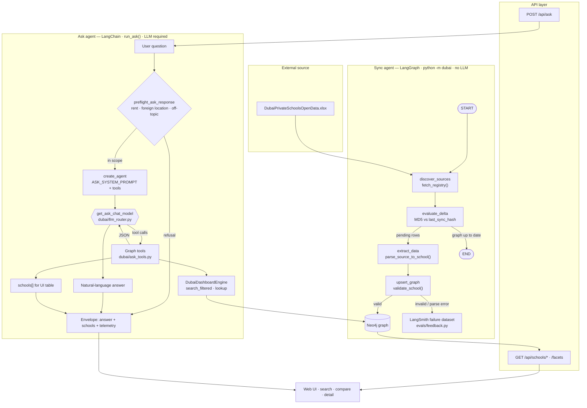
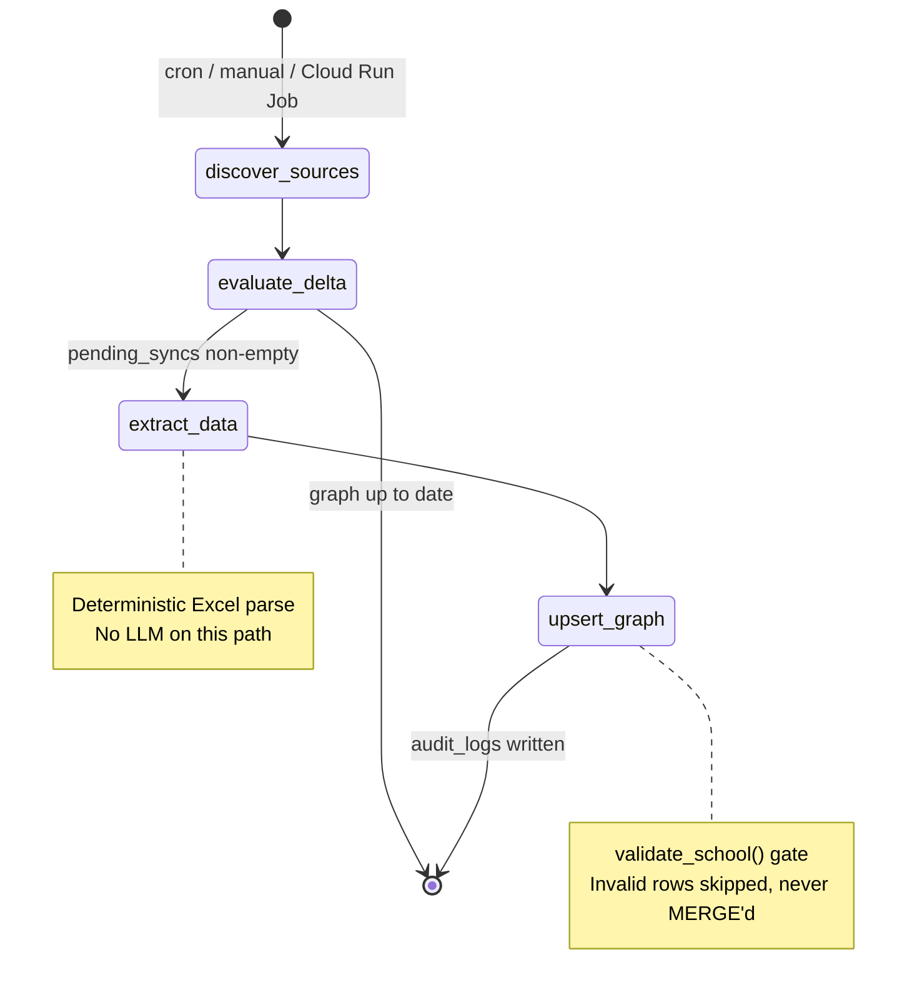
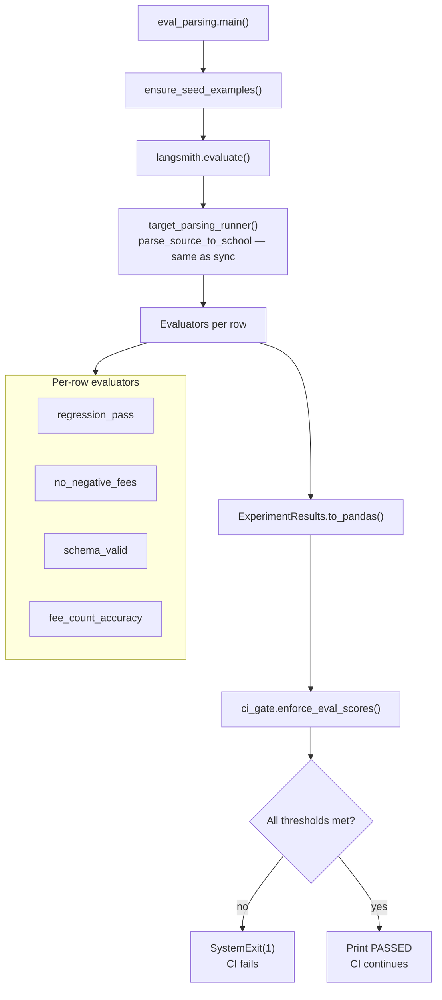
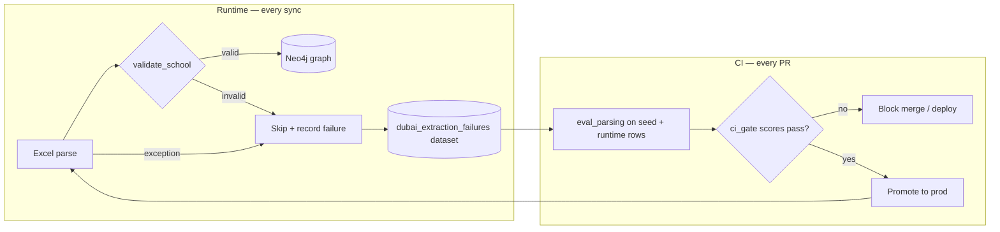

# Dubai School Search Platform — Architecture

Short reference for what the system must do, what it is built from, and how development harnesses, production agent runtime, and evaluation loops fit together.

Related: [User Manual](USER_MANUAL.md) (operations) · [README §9](../README.md#9-operations-guide--deploy-start-stop--refresh) (deploy/start/stop runbook) · [GitHub setup](GITHUB.md) · [README](../README.md) (full specification)

**Doc map:** Operations → User Manual + README §9 · Architecture & tracing → this file §2–§2.3 · API contract → README §3.6

---

## 1. Application Needs

### 1.1 Functional requirements

| Area | Requirement |
| --- | --- |
| **Data ingestion** | Download [DubaiPrivateSchoolsOpenData.xlsx](https://web.khda.gov.ae/KHDA/media/KHDA/DubaiPrivateSchoolsOpenData.xlsx); parse structured fields (including fees) into `SchoolDataModel`; MERGE into Neo4j with idempotent keys. Cached locally at `dubai_open_data_cache/private_schools.xlsx`. |
| **Incremental sync** | MD5 content-hash delta check — skip unchanged schools; only re-extract when source data changes. |
| **Search & discovery** | Faceted search by grade, budget, curriculum, area, and KHDA rating. |
| **School detail** | Per-school page: curricula, location, **latest KHDA inspection rating** (one academic year from open data), grade-level fee table. |
| **Comparison** | Side-by-side comparison of multiple schools; select from search results or open `/compare?ids=…`. |
| **Conversational Q&A** | Graph-backed `POST /api/ask`: preflight scope guards, then LangChain agent + Neo4j tools; returns `{ answer, model, schools[] }` plus per-call telemetry. |
| **Ask scope guards** | Deterministic preflight (no LLM): refuse rent/rental; refuse `schools in/of/from` foreign countries; refuse off-topic; allow UK/US/Indian **curriculum** filters in Dubai. |
| **Budget floor search** | Ask tool `min_budget_aed` — schools whose lowest fee tier exceeds the floor (`search_filtered(min_budget=…)`). REST search uses `max_budget` ceiling only. |
| **Multi-provider LLM routing** | Single router over OpenAI, Anthropic, Google, xAI, Groq, DeepSeek, GitHub Models, and local Ollama/vLLM. |
| **Graceful failure** | Validation failures and API errors return user-friendly messages — never raw stack traces. |

#### Agent orchestration (overview)

Two agents share Neo4j but run on separate paths: **Sync** (batch ingestion, no LLM) and **Ask** (interactive Q&A, LLM + graph tools).



**Sync agent** — linear LangGraph with one conditional branch (`evaluate_delta` → skip when nothing changed):



**Ask agent** — ReAct-style loop: the model chooses tools until it can answer; tool payloads are parsed into `schools[]`.

```mermaid
flowchart LR
  subgraph tools [Neo4j tools bound to DubaiDashboardEngine]
    T1[search_schools]
    T2[search_schools_by_budget_and_rating]
    T3[search_schools_by_grade_and_budget]
    T4[lookup_school_by_name]
  end

  H[HumanMessage] --> AGENT[LangChain agent]
  AGENT --> LLM[Selected chat model]
  LLM -->|ToolMessage JSON| AGENT
  AGENT --> T1 & T2 & T3 & T4
  T1 & T2 & T3 & T4 --> AGENT
  AGENT --> OUT[AIMessage answer]
  AGENT --> EXT["_extract_schools_from_messages()"]
  EXT --> TBL[schools[]]
```

| Agent | Engine | Trigger | Uses LLM? | Writes graph? |
| --- | --- | --- | --- | --- |
| **Sync** | LangGraph `StateGraph` | `python -m dubai`, cron, `dubai-sync` job | No | Yes (MERGE) |
| **Ask** | LangChain `create_agent` | `POST /api/ask` | Yes | No (read-only Cypher via tools) |

### 1.2 Non-functional requirements

| Area | Target |
| --- | --- |
| **Performance** | API p95 &lt; 400 ms for cached graph reads; Ask responses are **non-streaming** JSON today (streaming listed as future target). |
| **Scalability** | Stateless API and web tiers; horizontal scale behind a load balancer. |
| **Availability** | Health-checked containers; automatic restart; 99.5% uptime target. |
| **Security** | Secrets via env/Secret Manager; HTTPS in prod; CORS allow-list; Pydantic input validation. |
| **Observability** | Structured logs; LangSmith tracing; token/cost telemetry on every LLM call. |
| **Accessibility** | WCAG 2.1 AA on the web UI (semantic HTML, keyboard nav, ARIA). |
| **Portability** | Same container images on local MacBook and Google Cloud. |
| **Type safety** | Strict TypeScript on frontend; explicit Pydantic schemas on backend. |

---

## 2. Technology Components

```text
┌─────────────────────────────────────────────────────────────────┐
│  Web (Next.js App Router + React + TypeScript + Tailwind)       │
│  SearchClient · SchoolResultsTable · Compare · Detail · Ask     │
└────────────────────────────┬────────────────────────────────────┘
                             │ HTTPS JSON (Envelope: data + telemetry)
                             ▼
┌─────────────────────────────────────────────────────────────────┐
│  API Gateway (FastAPI + Uvicorn) — api_service.py               │
│  GET /api/schools/search · /compare · /{id} · /facets · /models │
│  POST /api/ask → run_ask()                                      │
└───────────────┬───────────────────────────────┬─────────────────┘
                │ Cypher (DubaiDashboardEngine)    │ Ask agent (LangChain)
                ▼                               ▼
┌───────────────────────────────┐   ┌───────────────────────────────┐
│  Neo4j 5.x — School · Location│   │  dubai/ask_agent.py            │
│  · Curriculum · Rating · Fee  │   │  tools → dashboard_queries    │
└───────────────────────────────▲─┘   └───────────────┬───────────────┘
                                │                     │ LLM router (Ask only)
                                │                     ▼
                                │         OpenAI / Anthropic / Google / GitHub …
                                │ idempotent MERGE (validated payloads only)
┌───────────────────────────────┴─────────────────────────────────┐
│  Sync Agent (LangGraph StateGraph) — deterministic Excel parse      │
│  discover → delta → parse (Excel) → upsert  (python -m dubai)      │
└─────────────────────────────────────────────────────────────────┘
```

| Layer | Technology | Key modules |
| --- | --- | --- |
| Frontend | Next.js, React, Tailwind | `web/app/page.tsx` (SSR facets), `SearchClient.tsx`, `AskPanel.tsx`, `SchoolResultsTable.tsx`, `CompareSelectionBar.tsx`, `ComparePageClient.tsx` |
| API | FastAPI, Pydantic | `api_service.py`, `dashboard_queries.py` |
| Ask agent | LangChain `create_agent` + tools | `dubai/ask_agent.py`, `dubai/ask_tools.py`, `dubai/ask_prompt.py` |
| Sync agent | LangGraph StateGraph | `dubai/agent.py`, `dubai/cli.py` (`python -m dubai`) |
| Graph DB | Neo4j 5.15+ (local Docker or Aura) | `dubai/graph_client.py`, `dashboard_queries.py` |
| Curriculum normalization | Alias matching for filters | `dubai/curriculum.py` |
| LLM routing | LangChain chat models | `dubai/llm_router.py` (`get_ask_chat_model` disables `parallel_tool_calls` for OpenAI/GitHub/DeepSeek) |
| Ask preflight | Deterministic scope guards (no LLM) | `dubai/ask_prompt.py` (`preflight_ask_response`, foreign-location + rent detection) |
| Validation | Pydantic + guardrails | `dubai/schemas.py`, `dubai/guardrails.py` |
| Cost accounting | LangChain callbacks | `dubai/cost_tracker.py` (Ask/API only) |
| Model pricing | YAML + optional LangSmith sync | `config/model_pricing.yaml`, `dubai/model_pricing.py`, `dubai/langsmith_pricing_sync.py` |
| LangSmith bootstrap | Env injection at API startup | `dubai/langsmith_env.py`, `dubai/provider_env.py` |
| Config | pydantic-settings | `dubai/settings.py` |
| Packaging | uv + hatchling | `pyproject.toml`, `uv.lock` |
| Containers | Docker Compose | `docker-compose.yml`, `Dockerfile`, `web/Dockerfile` |
| Cloud prod | Cloud Run, Artifact Registry, Secret Manager, Aura | `scripts/gcp_deploy.sh`, `scripts/gcp_sync_job.sh`, `deploy/cloudbuild-api.yaml`, `deploy/cloudbuild-web.yaml`, `deploy/cloudbuild-ci-deploy.yaml`, `deploy/webhook-relay/` |
| CI/CD | GitHub Actions → Cloud Build → Cloud Run | `.github/workflows/llm_regression_tests.yml`, `scripts/setup_github_actions_deploy.sh`, `scripts/setup_deploy_webhook.sh` |

**GCP secrets** (Secret Manager → Cloud Run `dubai-api`): `neo4j-pass`, `github-token`, `openai-key`, `google-key`, `groq-key`, `langchain-key`. See README §9.4 for the env-var mapping.

### 2.1 REST API surface

All routes return `Envelope { data, telemetry }` unless noted.

| Method | Path | Purpose |
| --- | --- | --- |
| `GET` | `/` | Health check |
| `GET` | `/api/models` | Selectable LLM ids (incl. `github:*`) |
| `GET` | `/api/facets` | Distinct curriculums, neighborhoods, ratings, grades |
| `GET` | `/api/schools/search` | Multi-facet search via `search_filtered()` |
| `GET` | `/api/schools/{id}` | School detail + fee table |
| `GET` | `/api/schools/compare?ids=` | Side-by-side compare rows |
| `POST` | `/api/ask` | Body `{ question, selected_model? }` → `{ answer, model, schools[] }` + telemetry |

Search and Ask both use `DubaiDashboardEngine.search_filtered()` for combined grade, budget, curriculum, KHDA rating, and neighborhood filters. **Budget direction:** REST `GET /api/schools/search` accepts `max_budget` (ceiling) only; Ask tool `search_schools` also accepts `min_budget_aed` (floor — lowest school fee tier must exceed the value) for “above / greater than” questions.

### 2.2 Ask agent runtime (separate from sync)

The **Ask** path is a second agent runtime — not LangGraph — wired in `dubai/ask_agent.py`:

```text
  POST /api/ask
       │
       ▼
  preflight_ask_response() — rent/rental/lease, schools in/of/from abroad, off-topic
       │ (refusal → answer only, schools[] empty, no LLM)
       ▼
  run_ask() → create_agent(model, tools, ASK_SYSTEM_PROMPT)
       │
       ├── search_schools          (max_budget_aed / min_budget_aed + optional filters)
       ├── search_schools_by_budget_and_rating
       ├── search_schools_by_grade_and_budget
       └── lookup_school_by_name
       │
       ▼
  Tool JSON → _extract_schools_from_messages() → schools[] in API envelope
```

Prompt rules in `dubai/ask_prompt.py` distinguish **curriculum labels** (UK, IB, …) from **foreign jurisdictions** (`schools in/of UK`), reject **rent/rental** as non-tuition terms, and mandate tool use before answering in-scope Dubai questions.

### 2.3 Observability & LangSmith tracing

| Environment | Tracing enabled? | How |
| --- | --- | --- |
| **Local dev** | When `.env` has `LANGCHAIN_TRACING_V2=true` + `LANGCHAIN_API_KEY` | `configure_langsmith_tracing()` at API startup |
| **GCP Cloud Run (`dubai-api`)** | **Yes — on by default** | `gcp_deploy.sh` sets `LANGCHAIN_TRACING_V2=true`, `LANGCHAIN_PROJECT`, mounts `LANGCHAIN_API_KEY` from Secret Manager `langchain-key` |
| **GCP sync job (`dubai-sync`)** | When job created via `gcp_sync_job.sh` | Same env vars on the job |
| **CI (GitHub Actions)** | Parsing eval job only | `LANGCHAIN_TRACING_V2=true` in workflow |

**What is traced in production:**

| Path | LangSmith signal |
| --- | --- |
| `POST /api/ask` | Full LangChain agent run (model, tools, tokens) → project `LANGCHAIN_PROJECT` |
| `python -m dubai` sync | LangGraph run metadata + tags when tracing env is set |
| API response | Token/cost also returned in `telemetry` envelope (`CostTracker`) |

**Not traced:** deterministic Excel parse steps without LangChain/LangGraph hooks; graph Cypher reads on search/facets routes.

To disable production tracing: redeploy `dubai-api` with `LANGCHAIN_TRACING_V2=false` or remove the env var; traces stop exporting but the API key secret can remain.

### 2.4 Model token pricing (Ask telemetry)

Ask requests report `telemetry.cost_usd` via `CostTracker`. Rates are **not** hardcoded in `MODEL_REGISTRY`; they load from `config/model_pricing.yaml` (`dubai/model_pricing.py`).

```text
  POST /api/ask
       │
       ▼
  CostTracker callback (per LLM call)
       │
       └── get_model_pricing(model_id) ← config/model_pricing.yaml
```

**LangSmith vs app cost:** LangSmith traces use LangSmith’s tenant price map. The API `telemetry` envelope uses the YAML table above — same token counts, potentially different USD totals.

**Optional startup sync** (`maybe_sync_pricing_from_langsmith()` in `api_service.py`, after `configure_langsmith_tracing()`):

| Step | Module | Behavior |
| --- | --- | --- |
| 1 | `dubai/langsmith_pricing_sync.py` | `GET https://api.smith.langchain.com/api/v1/model-price-map` |
| 2 | `config/langsmith_pricing_probes.yaml` | Registry id → probe string matched against LangSmith `match_pattern` regex |
| 3 | Merge | LangSmith USD/token × 1000 → `input_per_1k` / `output_per_1k`; unmatched ids keep YAML |
| 4 | Persist | `SYNC_LANGSMITH_PRICING_WRITE=true` writes YAML; else `seed_pricing_cache()` only |

| Setting | Default |
| --- | --- |
| `SYNC_LANGSMITH_PRICING` | `false` |
| `SYNC_LANGSMITH_PRICING_WRITE` | `false` |
| `LANGSMITH_PRICING_PROBES_PATH` | `config/langsmith_pricing_probes.yaml` |

Requires `LANGCHAIN_API_KEY`. Opt-in so startup never depends on LangSmith unless explicitly enabled.

---

## 3. Development Harness (Build & Test)

The **development harness** is the toolchain and CI pipeline that keeps application code correct before it reaches production.

### 3.1 Local harness

| Harness | Purpose | Entry point |
| --- | --- | --- |
| **uv** | Python deps, venv (3.14), lockfile | `uv sync` |
| **pytest** | Backend unit/integration tests (mocked, no live keys) | `uv run pytest -q` |
| **Vitest + Testing Library** | Frontend component tests | `cd web && npm test` |
| **Next.js dev server** | Hot-reload UI against local API | `cd web && npm run dev` |
| **Uvicorn --reload** | Hot-reload API | `uv run uvicorn api_service:app --reload` |
| **Docker Compose** | Full stack: Neo4j + API + sync + web | `docker compose up -d` |
| **Hybrid dev** | Neo4j in Docker; API + web on host with reload | See [README §9.1](../README.md#91-local-development--hybrid-recommended) |
| **Verify scripts** | Smoke-test open-data registry + parse | `scripts/verify_open_data_registry.py`, `scripts/verify_open_data_parse.py` |
| **GCP deploy script** | One-shot Cloud Run API + web + secrets | `scripts/gcp_deploy.sh` |

### 3.2 CI harness (GitHub Actions)

**Status:** Live on `main` — all four jobs pass; merge to `main` auto-deploys `dubai-api` + `dubai-web` to Cloud Run (`me-central1`).

Workflow: `.github/workflows/llm_regression_tests.yml`

```text
  push / PR
      │
      ├─► unit-tests (pytest, mocked)
      ├─► frontend (vitest + production build)
      └─► llm-evals (LangSmith parsing regression + ci_gate, needs unit-tests)
              │
              ▼ (main branch only, all jobs green)
         deploy-production
              │
              ├─► webhook path (when DEPLOY_WEBHOOK_* secrets set)
              │       POST → dubai-deploy-webhook Cloud Run relay
              │       → downloads main tarball → gcloud builds submit
              │
              └─► WIF fallback (google-github-actions/auth + gcloud builds submit)
                      → deploy/cloudbuild-ci-deploy.yaml (full stack)
```

| Job | Gate | What it protects |
| --- | --- | --- |
| `unit-tests` | Required | Schemas, guardrails, router, API routes, agent nodes, eval logic |
| `frontend` | Required | UI regressions; build-time env (`NEXT_PUBLIC_API_BASE_URL`) |
| `llm-evals` | Required (after unit) | Open-data parsing quality against seed dataset; **`ci_gate`** enforces thresholds |
| `deploy-production` | **`main` only** | No Cloud Run promotion until tests + evals pass |

**Setup scripts** (run once per repo/GCP project):

| Script | Purpose |
| --- | --- |
| `scripts/setup_github_actions_deploy.sh` | Workload Identity Federation, `github-actions-deploy` SA, GitHub secrets (`GCP_*`, `NEO4J_URI`) |
| `scripts/setup_deploy_webhook.sh` | Native Cloud Build webhook (region-dependent) **or** Cloud Run relay `dubai-deploy-webhook`; sets `DEPLOY_WEBHOOK_URL` + `DEPLOY_WEBHOOK_TOKEN` |

**Deploy artifact:** `deploy/cloudbuild-ci-deploy.yaml` — build/push API → deploy `dubai-api` → resolve URL → build/push web → deploy `dubai-web` → patch API CORS. Same pipeline for webhook relay and WIF submit.

See [GITHUB.md](GITHUB.md) for secrets and branch protection.

This is the **application build harness**: every merge candidate is compiled, unit-tested, UI-tested, and LLM-regression-tested before promotion.

---

## 4. Production Agent Harness (Runtime)

Two distinct runtimes share Neo4j but serve different paths:

| Runtime | Engine | Trigger | LLM? |
| --- | --- | --- | --- |
| **Sync agent** | LangGraph (`dubai/agent.py`) | `python -m dubai`, cron, Cloud Run Job | No — deterministic Excel parse |
| **Ask agent** | LangChain (`dubai/ask_agent.py`) | `POST /api/ask` | Yes — tool-calling chat model |

### 4.1 Sync workflow (LangGraph)

Four nodes wired by `compile_sync_workflow()` in `dubai/agent.py`:

```text
  START
    │
    ▼
 discover_sources ──► evaluate_delta ──► [pending?] ──yes──► extract_data
                              │                                    │
                              no                                   ▼
                              ▼                              upsert_graph ──► END
                             END
```

| Node | Responsibility |
| --- | --- |
| `discover_sources` | Download and parse `DubaiPrivateSchoolsOpenData.xlsx` from `https://web.khda.gov.ae/KHDA/media/KHDA/DubaiPrivateSchoolsOpenData.xlsx`. |
| `evaluate_delta` | Compare content hashes to Neo4j `last_sync_hash`; enqueue only changed records. |
| `extract_data` | Map each registry row to `SchoolDataModel` via `parse_source_to_school()` (no LLM). |
| `upsert_graph` | Run `validate_school()` guardrails; MERGE valid records; skip invalid. |

### 4.2 Production runtime options

| Environment | Harness | Schedule |
| --- | --- | --- |
| **Docker Compose** | `sync_agent` service + cron in root `Dockerfile` (02:00 daily) | `run_school_db_agent_cron.sh` |
| **Native / VM** | `./run_school_db_agent_cron.sh` (loads `.env`, logs to `./logs/`) | cron or manual |
| **Google Cloud** | Cloud Run (`dubai-api`, `dubai-web`) + optional Cloud Run Job (`dubai-sync`) | `./scripts/gcp_deploy.sh`; Neo4j on **Aura** |

Each sync run carries **RunnableConfig** metadata (`run_id`, `pipeline_version`, LangSmith tags). Token/cost tracking applies to **Ask** (`/api/ask`) only — sync parsing is deterministic. Ask tracing uses `configure_langsmith_tracing()` at API startup when `LANGCHAIN_*` vars are set.

### 4.3 Runtime constraints (in-process harness)

| Mechanism | Role |
| --- | --- |
| `validate_school()` | Blocks corrupt parses before any Cypher write. |
| `safe_negative_response()` | Standard user-facing message on API/agent failure. |
| MD5 delta gate | Skips unchanged workbook rows (no re-parse). |
| `CostTracker` | Per-call token + cost accounting on **Ask** requests. |
| `apply_constraints()` | Neo4j uniqueness constraints applied at sync start. |

---

## 5. Evaluation Framework & Self-Correcting Loop

Evaluation operates at **three layers** that together keep the application self-correcting: reject bad data at ingestion, catch model regressions before deploy, and grow the regression corpus over time.

### 5.1 Layer A — Runtime guardrails + feedback (online, every sync)

Before any graph write, `upsert_knowledge_graph_node` calls `validate_school()`:

- Requires `school_id`, `name`, non-empty neighborhood.
- Requires at least one fee row; each `tuition_fee` must be &gt; 0.

**Invalid payloads are skipped** — they never enter the graph. Additionally, validation failures and parse exceptions append to the LangSmith dataset `dubai_extraction_failures` via `evals/feedback.py` when `LANGCHAIN_API_KEY` is set.

| Module | Role |
| --- | --- |
| `dubai/agent.py` | Carries `document_text` through parse; calls `FailureRecorder` on guardrail/parse failure |
| `evals/feedback.py` | `LangSmithFailureRecorder` → `append_failure_example()` |
| `evals/datasets.py` | Dedupes by `school_id:content_hash`; tags rows `source: runtime` |

Sync run summary (`python -m dubai`) reports `validation_failures`, `extraction_failures` (parse failures), and `failures_recorded`.

### 5.2 Layer B — LangSmith regression evals (offline, every PR)

Package: `evals/`

| Suite | Module | Evaluators | CI |
| --- | --- | --- | --- |
| **Primary — open-data parsing** | `eval_parsing.py` | `regression_pass`, `no_negative_fees`, `schema_valid`, `fee_count_accuracy` | ✅ on every PR |
| **Secondary — QA** | `eval_qa.py` | `semantic_match` (cosine similarity) plus deterministic Ask guards: `no_false_jurisdiction_refusal`, `jurisdiction_refusal_when_required`, `foreign_location_must_refuse`, `invalid_fee_term_refusal_when_required` (`evals/ask_evaluators.py`) | Manual / nightly |

Critical design choice: `target_parsing_runner()` invokes the **same production parser** (`parse_source_to_school`) as the sync agent — no eval/prod divergence.

Datasets (`evals/datasets.py`):

- `dubai_extraction_failures` — in-code seed cases (`source: seed`) **plus** runtime-appended failures (`source: runtime`).
- `dubai_qa` — Q&A semantic match references.

| Function | Behavior |
| --- | --- |
| `ensure_seed_examples()` | Upserts seed rows before eval; **never deletes** runtime examples |
| `append_failure_example()` | Deduped append from production sync |
| `sync_dataset()` | Full replace for small fixed sets (QA only) |

`fee_count_accuracy` skips unlabeled runtime rows (no `expected_fee_count`) so CI is not penalized for failures awaiting human review.

### 5.3 Layer C — Deploy gate (`ci_gate`)

The **CI gate** is the hard stop between “eval ran” and “safe to merge/deploy”. It lives in `evals/ci_gate.py` and is invoked at the end of `evals/eval_parsing.main()` unless `--skip-ci-gate` is passed.

#### What it does

After LangSmith `evaluate()` finishes the open-data parsing experiment, `enforce_eval_scores()`:

1. Converts `ExperimentResults` to a pandas DataFrame (`to_pandas()`).
2. Computes the **mean score** per evaluator column (handles `feedback.<name>` prefixes).
3. Compares means to fixed thresholds.
4. **`SystemExit(1)`** on failure → GitHub Actions job fails → merge/deploy blocked.
5. Prints **`Eval CI gate PASSED`** with aggregated scores on success.

It is **not** a standalone CLI (`ci_gate.main()` exits 2 if called directly). Entry point is always through `eval_parsing`.

#### Score thresholds

| Evaluator | Required? | Min mean | What it measures (in `eval_parsing.py`) |
| --- | --- | --- | --- |
| `regression_pass` | Yes | **1.0** | `fees_count > 0` and neighborhood present |
| `no_negative_fees` | Yes | **1.0** | Every parsed `tuition_fee > 0` |
| `schema_valid` | Yes | **1.0** | Output reconstructs as `SchoolDataModel` |
| `fee_count_accuracy` | Only if column present | **0.75** | `min(extracted, expected) / expected` when `expected_fee_count` is labeled |

Missing any of the three binary evaluators → fail (`"<name>: missing"`).

`fee_count_accuracy` returns score `1.0` with a skip comment for runtime rows **without** `expected_fee_count`, so unlabeled production failures do not drag down the mean.

#### How it runs (flow)



#### Where it plugs into CI

```text
  code change
      │
      ▼
  pytest ──fail──► stop (no deploy)
      │ pass
      ▼
  frontend test + build ──fail──► stop
      │ pass
      ▼
  LangSmith parsing eval + ci_gate ──fail──► stop
      │ pass (main only)
      ▼
  deploy-production
      │
      ├─► webhook POST (DEPLOY_WEBHOOK_URL) → Cloud Run relay → Cloud Build
      └─► or WIF gcloud builds submit → deploy/cloudbuild-ci-deploy.yaml
              │
              ▼
         dubai-api + dubai-web on Cloud Run (CORS updated)
```

GitHub Actions (`.github/workflows/llm_regression_tests.yml`) runs `uv run python -m evals.eval_parsing` in the `llm-evals` job with `LANGCHAIN_API_KEY` from repo secrets. No LLM provider key is required — eval exercises the **deterministic Excel parser**, not Ask.

**Local debugging** (inspect LangSmith URL without failing the shell):

```bash
uv sync --extra evals
uv run python -m evals.eval_parsing --skip-ci-gate
```

**Not in scope for `ci_gate`:** Ask/Q&A quality (`evals/eval_qa.py`) — manual/nightly only. QA eval runs the same deterministic Ask guard evaluators as production preflight rules (curriculum vs foreign location, rent refusal) plus optional `semantic_match` when `uv sync --extra evals` is installed.

#### Implementation reference

```python
# evals/ci_gate.py — simplified
REQUIRED_EVALUATORS = ("regression_pass", "no_negative_fees", "schema_valid")
MIN_BINARY_SCORE = 1.0
MIN_FEE_COUNT_SCORE = 0.75
```

```python
# evals/eval_parsing.py — gate hook
if not args.skip_ci_gate:
    enforce_eval_scores(experiment_results)
```

### 5.4 Full self-correcting loop (implemented)



**How it self-corrects:**

1. **Ingestion gate** — corrupt parses never pollute the graph.
2. **Regression corpus** — validation and parse failures append to `dubai_extraction_failures`, expanding what CI must pass on the next run.
3. **Deploy gate** — `ci_gate` enforces score thresholds; failing evals block production promotion.
4. **Delta sync** — unchanged sources skip re-parse.
5. **Same-chain evals** — CI tests the exact parser production uses.

**Requirements to activate the feedback edge:**

| Variable | Required for |
| --- | --- |
| `LANGCHAIN_API_KEY` | Runtime failure recording + CI evals |
| `LANGCHAIN_TRACING_V2=true` | LangSmith tracing (recommended) |
| Outbound HTTPS from sync worker | LangSmith API from cron / Cloud Run Job |

Unlabeled runtime rows rely on `regression_pass`, `no_negative_fees`, and `schema_valid` until an operator adds `expected_fee_count` in LangSmith for stricter `fee_count_accuracy` checks.

### 5.5 Observability tie-in

| Signal | Local / CI | Production (GCP) |
| --- | --- | --- |
| LangSmith traces | Ask + sync when `.env` / workflow vars set | **On by default** on `dubai-api` via `LANGCHAIN_TRACING_V2=true` + `langchain-key` secret |
| LangSmith project | `LANGCHAIN_PROJECT` (default `dubai-graph-sync-agent`) | Same — set on Cloud Run by `gcp_deploy.sh` |
| LangSmith dataset | `dubai_extraction_failures` (seed + runtime rows) | Sync failures append when worker has `LANGCHAIN_API_KEY` |
| Token / cost | `CostTracker` → API `telemetry` envelope (Ask only); rates from `config/model_pricing.yaml` | Same on Cloud Run Ask; optional `SYNC_LANGSMITH_PRICING` at startup |
| Sync audit | `audit_logs`: pending, created, updated, failures | Cloud Run Job logs + LangSmith sync traces |
| Cron logs | `./logs/sync_*.log` (30-day retention) | Cloud Logging for Cloud Run services/jobs |

Dashboard: [smith.langchain.com](https://smith.langchain.com) → project **`dubai-graph-sync-agent`** (or your `LANGCHAIN_PROJECT`).

---

## 6. Summary

| Concern | Mechanism |
| --- | --- |
| **What it must do** | Ingest KHDA data → graph → search / compare / ask UI (with preflight scope guards + min/max budget semantics) |
| **What it is built from** | Next.js + FastAPI + LangGraph sync + LangChain Ask + Neo4j + multi-provider LLM router |
| **Dev build harness** | uv, pytest, Vitest, hybrid dev or Docker Compose, **GitHub Actions CI/CD (live)**, `gcp_deploy.sh`, setup scripts |
| **Prod agent harness** | LangGraph sync (cron/Cloud Run Jobs) + LangChain Ask (Cloud Run API), guardrails, LangSmith |
| **Evaluation & self-correction** | Runtime validation → LangSmith dataset feedback → CI regression + `ci_gate` → **auto-deploy gate on `main`** |
